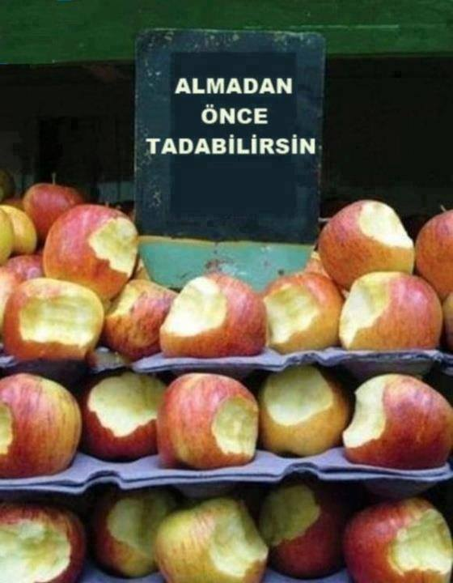

# learning

you can taste it before you buy it

This is a repository for learning new things. It is a place to store code and notes for future reference.

### UPDATES
Thu Feb 8 23:22 UTC+3 2024

I don't want another bitten apple anymore, from now on I'm going to work on my basic deficiencies and that is Computer Science. 
[More details in this blog post](https://cihat.dev/2024/cs-basics-series)
